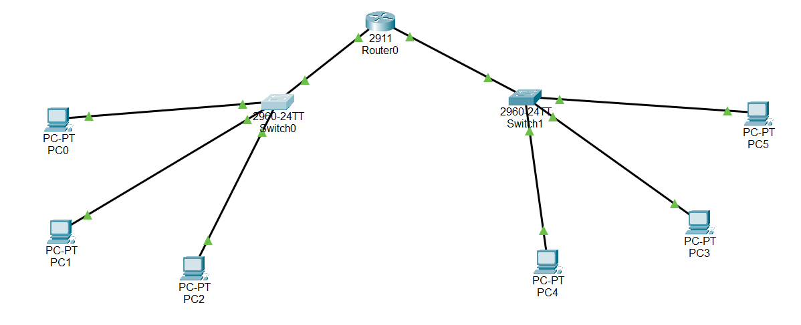

# Lab 01 – Basic LAN & IP Addressing

## Objective
Demonstrates fundamental LAN design using static IP addressing across two 
subnets connected through a router. Establishes the foundation for more 
advanced labs involving VLANs and dynamic routing.

## Topology

## Devices Used
- 1x Router (Cisco 1941)
- 2x Switch (Cisco 2960)
- 6x PC

## IP Addressing Table

| Device  | Interface | IP Address     | Subnet Mask     | Gateway        |
|---------|-----------|-----------------|------------------|----------------|
| Router0 | Gi0/0     | 192.168.10.1    | 255.255.255.0    | —              |
| Router0 | Gi0/1     | 192.168.20.1    | 255.255.255.0    | —              |
| PC0–PC2 | NIC       | 192.168.10.10–12| 255.255.255.0    | 192.168.10.1   |
| PC3–PC5 | NIC       | 192.168.20.10–12| 255.255.255.0    | 192.168.20.1   |

## Key Configurations

\`\`\`
interface GigabitEthernet0/0
 ip address 192.168.10.1 255.255.255.0
 no shutdown

interface GigabitEthernet0/1
 ip address 192.168.20.1 255.255.255.0
 no shutdown
\`\`\`

## Verification
- Successful ping between PC0 (subnet 1) and PC3 (subnet 2), confirming 
  inter-subnet routing through Router0.
- `show ip interface brief` confirms both interfaces are up/up.

## What I Learned / Real-World Application
This lab mirrors the basic site segmentation I maintain at Qneticx, where 
separate subnets are used to isolate different areas of the network before 
applying VLANs and access control. Getting addressing and routing right at 
this foundational level is what makes later VLAN and ACL configuration 
straightforward.
