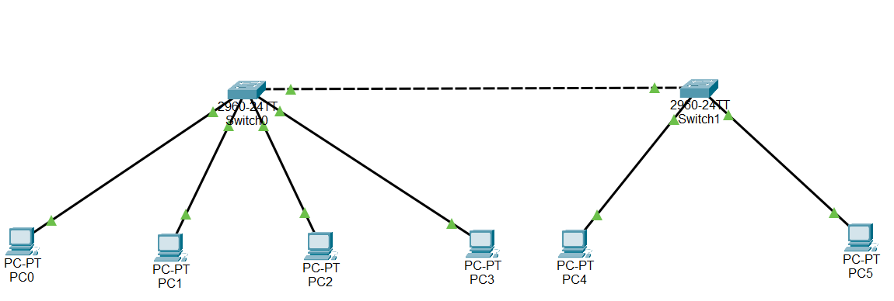

# Lab 02 – VLAN Segmentation & Trunking

## Objective
Demonstrates logical network segmentation using VLANs across two switches, 
connected via a trunk link. Shows how departments can share physical 
infrastructure while remaining isolated at Layer 2.

## Topology

## Devices Used
- 2x Switch (Cisco 2960)
- 6x PC

## VLAN Plan

| VLAN ID | Name  | Subnet           |
|---------|-------|------------------|
| 10      | Sales | 192.168.10.0/24  |
| 20      | IT    | 192.168.20.0/24  |

## Key Configurations

\`\`\`
vlan 10
 name Sales
vlan 20
 name IT

interface FastEthernet0/1
 switchport mode access
 switchport access vlan 10

interface GigabitEthernet0/1
 switchport mode trunk
\`\`\`

## Verification
- PC0 (VLAN 10) successfully pings PC4 (VLAN 10, different switch) — confirms 
  the trunk link correctly carries tagged VLAN traffic between switches.
- PC0 (VLAN 10) **fails** to ping PC1 (VLAN 20) — confirms VLAN isolation is 
  working as intended.
- `show vlan brief` confirms correct VLAN-to-port assignment on both switches.
- `show interfaces trunk` confirms the trunk is active and allowing VLANs 10 and 20.

## What I Learned / Real-World Application
This mirrors how I segment traffic at Qneticx when deploying VLANs across 
multi-floor buildings — keeping departments or tenant groups isolated on 
shared switching hardware. The failed ping between VLANs is intentional; 
full connectivity is addressed in Lab 3 using inter-VLAN routing.
