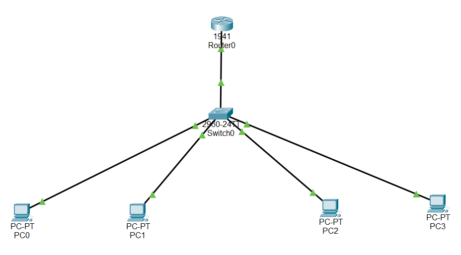

# Lab 03 – Inter-VLAN Routing

## Objective
Demonstrates inter-VLAN routing using router-on-a-stick, allowing devices in 
different VLANs to communicate through a single router interface using 
802.1Q sub-interfaces. Resolves the VLAN isolation introduced in Lab 02.

## Topology

## Devices Used
- 1x Router (Cisco 1941)
- 1x Switch (Cisco 2960)
- 4x PC

## VLAN & IP Plan

| VLAN ID | Name  | Subnet           | Gateway        |
|---------|-------|------------------|----------------|
| 10      | Sales | 192.168.10.0/24  | 192.168.10.1   |
| 20      | IT    | 192.168.20.0/24  | 192.168.20.1   |

## Key Configurations

\`\`\`
interface GigabitEthernet0/0
 no shutdown

interface GigabitEthernet0/0.10
 encapsulation dot1Q 10
 ip address 192.168.10.1 255.255.255.0

interface GigabitEthernet0/0.20
 encapsulation dot1Q 20
 ip address 192.168.20.1 255.255.255.0
\`\`\`

## Verification
- PC0 (VLAN 10) successfully pings PC1 (VLAN 20) — confirms inter-VLAN 
  routing is functioning correctly through the router's sub-interfaces.
- `show ip interface brief` confirms both sub-interfaces (Gi0/0.10, Gi0/0.20) 
  are up/up.
- `show vlan brief` confirms VLAN-to-port mapping on the switch is unchanged 
  from Lab 02.

## What I Learned / Real-World Application
Router-on-a-stick is a cost-effective way to route between VLANs without a 
Layer 3 switch — useful in smaller deployments. At Qneticx, similar 
principles apply when configuring routed connectivity between segmented 
subnets across sites. This lab also reinforced how trunk links and 
sub-interfaces work together: the switch tags frames per VLAN, and the 
router's sub-interfaces decode those tags to apply the correct IP context.
