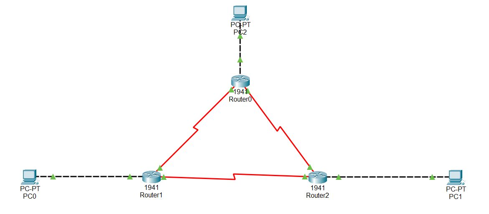

# Lab 05 – ACLs & Network Security

## Objective
Demonstrates traffic filtering using a single extended ACL to enforce 
site-level access policy: fully isolating one site, while allowing 
monitoring (ICMP) but not administrative access (Telnet) from another.

## Topology
Builds on the Lab 04 three-site OSPF topology.

## Security Policy

| Source (Site)            | Destination (Site A)   | Rule                          |
|----------------------------|--------------------------|--------------------------------|
| Site C (192.168.3.0/24)   | 192.168.1.0/24           | Denied entirely                |
| Site B (192.168.2.0/24)   | 192.168.1.0/24           | ICMP permitted, Telnet denied  |
| All other traffic          | —                        | Permitted                      |

## Key Configuration

\`\`\`
access-list 100 deny ip 192.168.3.0 0.0.0.255 192.168.1.0 0.0.0.255
access-list 100 permit icmp 192.168.2.0 0.0.0.255 192.168.1.0 0.0.0.255
access-list 100 deny tcp 192.168.2.0 0.0.0.255 192.168.1.0 0.0.0.255 eq 23
access-list 100 permit ip any any

interface GigabitEthernet0/0
 ip access-group 100 out
\`\`\`

## Verification
- PC2 (Site C) ping to Site A fails — confirms full isolation.
- PC1 (Site B) ping to Site A succeeds — confirms ICMP explicitly permitted.
- Telnet from Router1 to Router0 fails — confirms administrative access blocked.
- `show access-lists 100` confirms hit counters incrementing on the matching 
  ACL lines, verifying which rule caught which traffic type.

## What I Learned / Real-World Application
This lab mirrors real network segmentation policies — for example, 
restricting a branch site to monitoring-only access while blocking 
management protocols like Telnet/SSH from untrusted segments. It also 
reinforced that only one ACL can be applied per interface per direction, 
and that careful rule ordering is essential since ACLs are evaluated 
top-down with an implicit deny at the end. Verifying which device was 
actually generating traffic (rather than assuming based on labeling) was 
also a useful real-world troubleshooting lesson.
