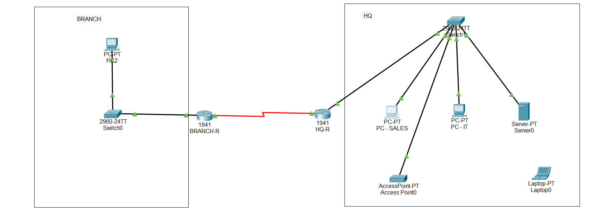

Excellent — that's all 6 labs complete. That's a genuinely strong portfolio for someone in your position. Before pointing you to the next project, let's make sure Lab 6 gets its proper write-up since it's the capstone piece.

Lab 6 README (ready to commit)
markdown# Lab 06 – Enterprise Capstone

## Objective
Combines VLANs, inter-VLAN routing, OSPF, wireless connectivity, and ACL-based 
security into a single two-site enterprise topology. Represents a realistic 
small business network with a Headquarters site and a connected Branch office.

## Topology

## Devices Used
- 2x Router (Cisco 1941 with HWIC-2T serial modules)
- 2x Switch (Cisco 2960)
- 1x Access Point (AccessPoint-PT)
- 4x PC, 1x Server, 1x Laptop (wireless client)

## Network Design

| Site   | VLAN | Name      | Subnet           |
|--------|------|-----------|-------------------|
| HQ     | 10   | Sales     | 192.168.10.0/24   |
| HQ     | 20   | IT        | 192.168.20.0/24   |
| HQ     | 30   | Servers   | 192.168.30.0/24   |
| HQ     | 99   | Wireless  | 192.168.99.0/24   |
| Branch | 40   | Branch Users | 192.168.40.0/24 |

WAN link (HQ-R ↔ Branch-R): 10.0.0.0/30, routed via OSPF.

## Key Configurations

\`\`\`
interface GigabitEthernet0/0.10
 encapsulation dot1Q 10
 ip address 192.168.10.1 255.255.255.0

router ospf 1
 network 192.168.10.0 0.0.0.255 area 0
 network 10.0.0.0 0.0.0.3 area 0

access-list 100 deny ip 192.168.40.0 0.0.0.255 192.168.30.0 0.0.0.255
access-list 100 permit ip any any

interface GigabitEthernet0/0.30
 ip access-group 100 out
\`\`\`

## Verification
- `show ip ospf neighbor` confirms FULL adjacency between HQ-R and Branch-R.
- Inter-VLAN routing confirmed: Sales, IT, and Servers can all reach each other within HQ.
- Cross-site routing confirmed: Branch successfully reaches Sales and IT over the WAN.
- Wireless client (Laptop) successfully joins VLAN 99 and reaches wired VLANs.
- ACL confirmed: Branch is blocked from the Servers VLAN, while retaining access to Sales and IT.

## What I Learned / Real-World Application
This lab tied together every concept from Labs 1–5 into a single realistic 
topology, closely resembling a small business with a head office and a 
remote branch. Troubleshooting an end-to-end connectivity issue that wasn't 
visible in any single component's status output — despite OSPF, ARP, trunking, 
and routing tables all checking out individually — was the most valuable 
part of this lab.
